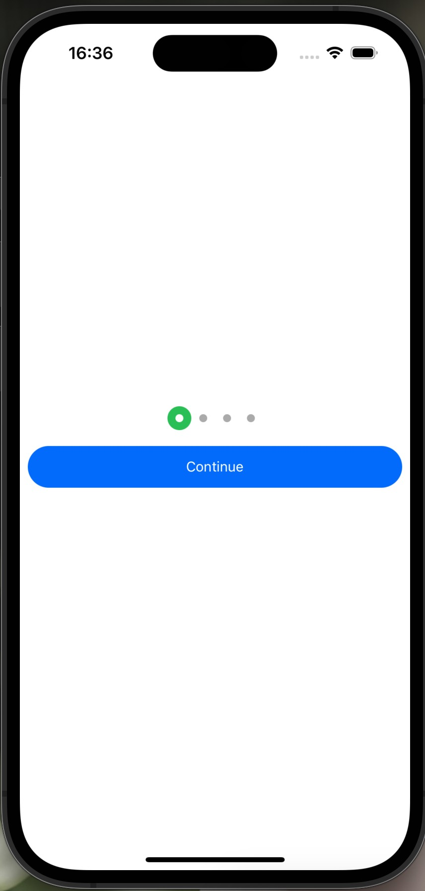

# React Native Onboarding Pagination Indicator - Reanimated

[:+1: 视频地址 youtube :+1:](https://youtu.be/m8ATJwrAif0?si=18wu1582Kmp73mT0)

## 介绍

这是一个基于 React Native 开发的 App，它使用了 Reanimated 库来实现一个漂亮的分页指示器。

## 功能

- 显示一个漂亮的分页指示器。
- 通过 Reanimated 库实现了动画效果。
- 显示两个按钮，一个用于上一页，一个用于下一页。

